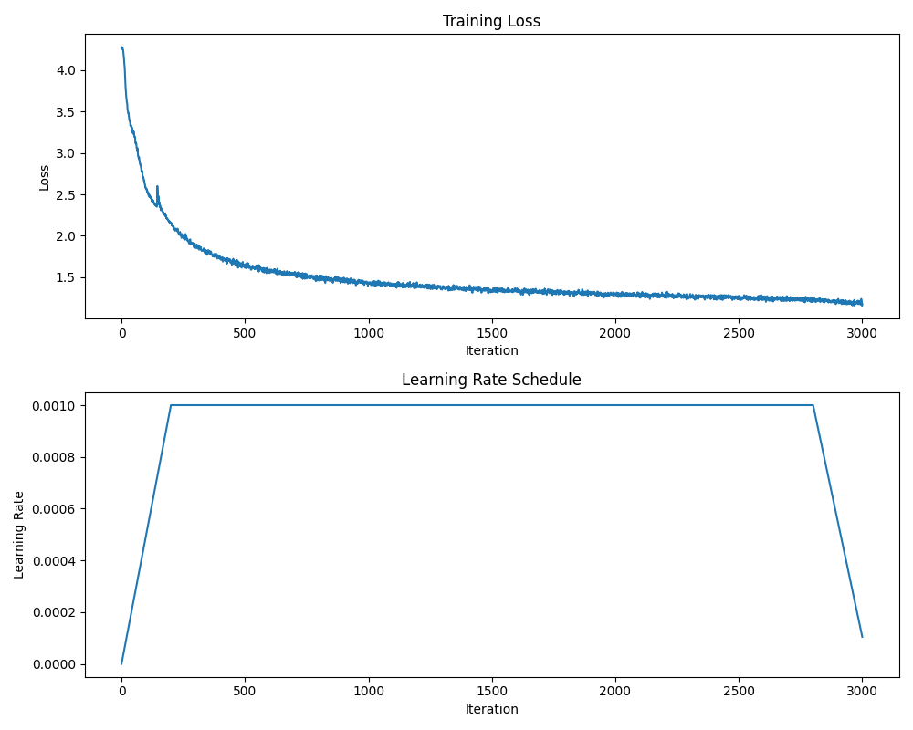

# GPT from scratch

B: batch size
S: block size
L: number of blocks
H: number of heads
E: embedding size

## MHA with RoPE

(B, S, L, H, E) = (128, 128, 8, 4, 128)
lr_max = 1e-3
lr_min = 1e-4
total_iters = 3001
warmup_iters = 200
anneal_iters = 200

train_loss: 1.2031, val_loss: 1.2188

## MHA with RoPE and GELU

(B, S, L, H, E) = (128, 128, 8, 4, 128)
lr_max = 1e-3
lr_min = 1e-4
total_iters = 3001
warmup_iters = 200
lr_decay_iters = total_iters
anneal_iters = 200

